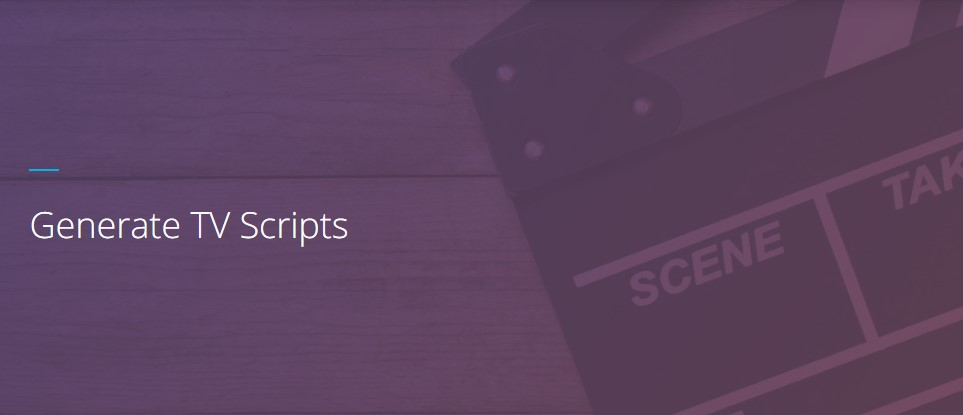

This repository contains all my work for the Deep Learning Nanodegree.

# Projects Assignments

## 1) [Predicting Bike-Sharing Patterns](https://github.com/3outeille/DLND-Labs/tree/master/src/project-1-predicting-bike-sharing-patterns)

## 2) [Dog-Breed Classifier](https://github.com/3outeille/DLND-Labs/tree/master/src/project-2-dog-breed-classifier)

## 3) [Generate TV Scripts](https://github.com/3outeille/DLND-Labs/tree/master/src/project-3-generate-tv-scripts)

## 4) [Generate Faces](https://github.com/3outeille/DLND-Labs/tree/master/src/project-4-generate-faces)

## 5) [Deploying a Sentiment Analysis Model](https://github.com/3outeille/DLND-Labs/tree/master/src/project-5-deploying-a-sentiment-analysis-model)

